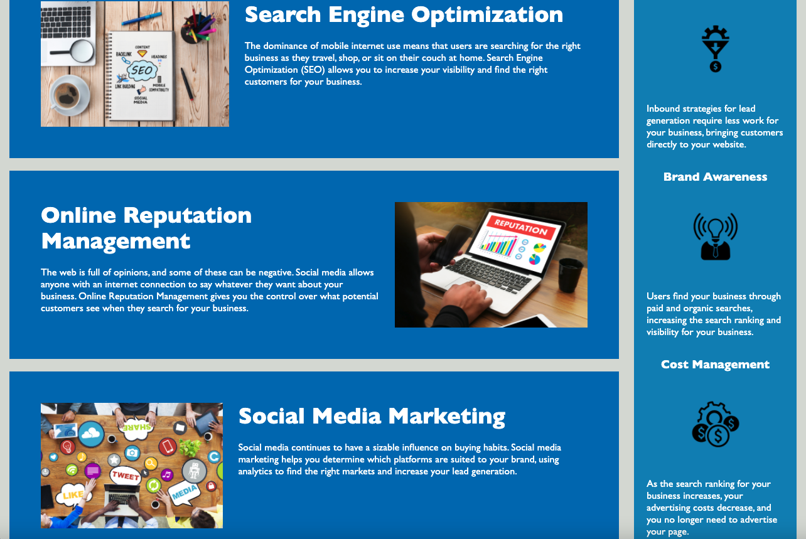

# horiseon_accessibility_optimization

## Description

This project was motivated by the desire to showcase small and simple steps that can be taken in order to make a webpage more accessible and more semantic. This project was built in order to optimize the accessibily of the Horiseon website with screen readers in mind. The changes made solve issues that individuals may have while navigating the Horiseon webpage while using a screen reader. 

Throughout this process I learned of simple ways to make html elements more semantic in the source code by using proper indentation, nesting, and spacing. I also became much more familiar with semantic elements and their purpose and uses. 

## Horiseon Webpage Image

## Deployed Link 

https://martinmondaca.github.io/horiseon_accessibility_optimization/

## License

Licensed under [MIT](https://choosealicense.com/licenses/mit/) license.
